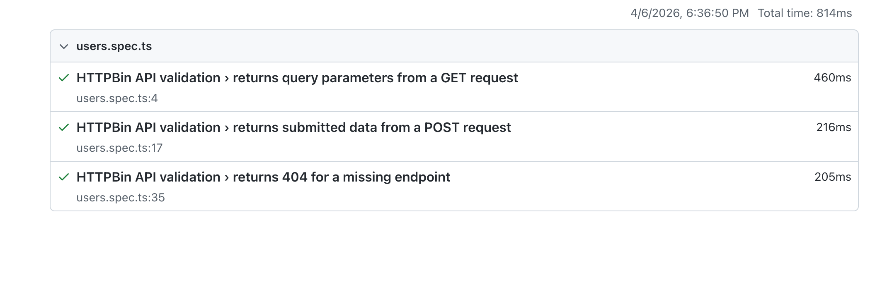

# API Testing Sample

This folder contains a sample API testing project built with Playwright and TypeScript. It is designed to show a clean and readable approach to API validation using a public demo API.

## API Under Test

The sample tests use `https://httpbin.org`, a public service commonly used to validate API requests and responses.

## Project Structure

- `package.json`
  Defines the project dependencies and commands used to run the API tests.
- `playwright.config.ts`
  Contains Playwright configuration for API test execution.
- `tsconfig.json`
  Defines TypeScript compiler settings for the API test project.
- `tests/users.spec.ts`
  Covers sample API scenarios, including `GET`, `POST`, and `404` validation.

## Coverage Included

- Verify a `GET` request returns the expected query parameters
- Verify a `POST` request returns the expected request body
- Verify a missing endpoint returns a `404` response

## How To Run

1. Open a terminal in `api-testing-sample`
2. Install dependencies with `npm install`
3. Run the tests with `npm test`

## Sample Test Result

The screenshot below shows the API test suite running successfully in the Playwright test results view.

## Purpose

This sample is intended to demonstrate a practical API testing structure using Playwright with TypeScript in a way that is easy to review and understand.
